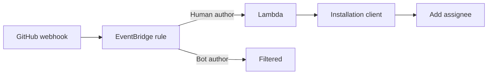

# PR Auto-Assign

Assigns a newly opened pull request to its author.

The EventBridge rule filters bot-authored pull requests before Lambda
invocation. GitHub responses with status 403 or 422 are logged and skipped;
other errors propagate so Lambda retry behavior applies.
